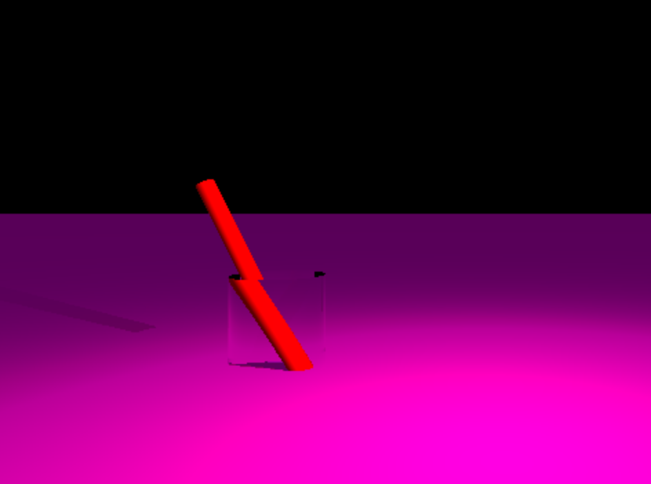
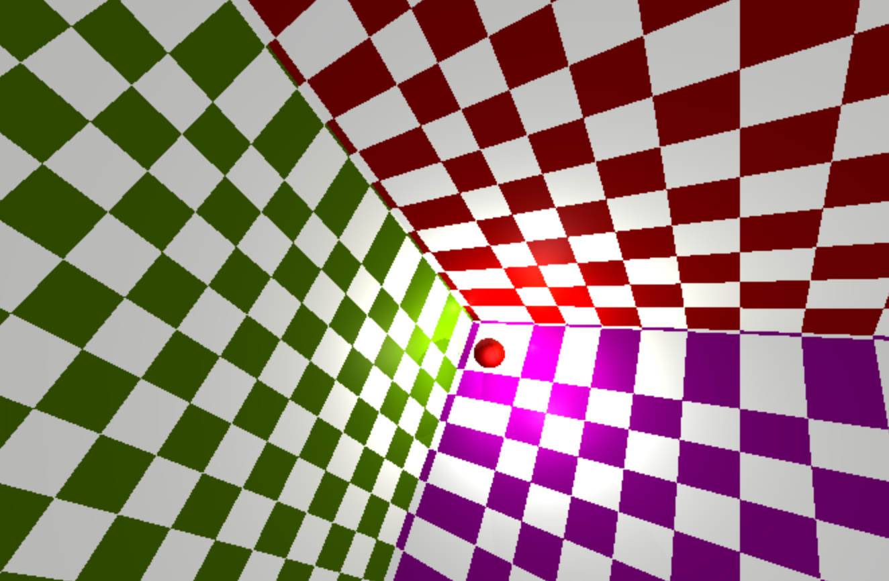
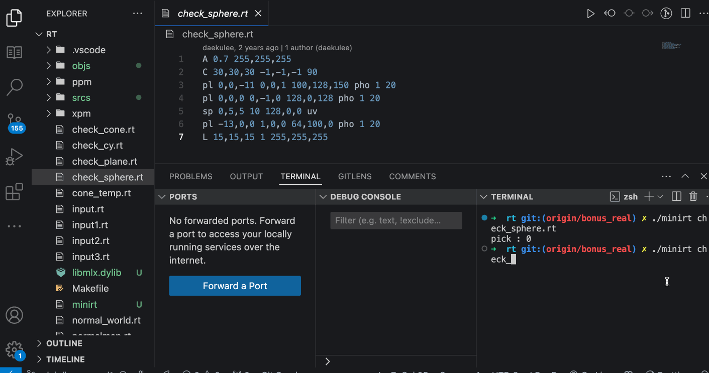
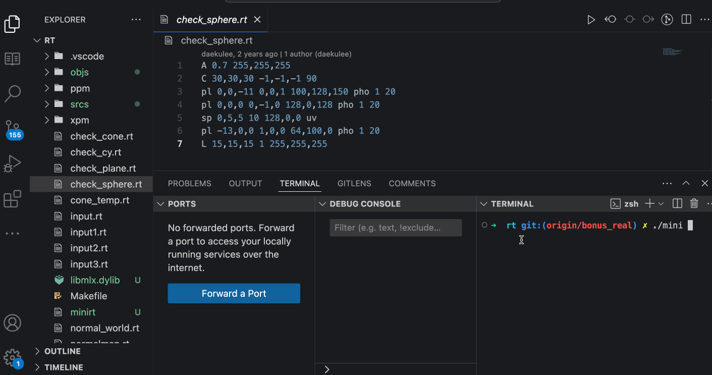

# miniRT: 실시간 레이 트레이싱 프로젝트

## 프로젝트 개요

_위 이미지는 예시입니다. 실제 이미지를 추가하실 때 경로/파일명을 변경하세요._

miniRT는 **C 언어**로 작성된 간단한 레이 트레이싱(Ray Tracing) 렌더러로, **실시간에 가까운 상호작용 성능**으로 3차원 장면을 화면에 구현합니다.  
레이 트레이싱은 광선의 경로를 추적하여 반사, 굴절, 그림자 등의 광학 현상을 사실적으로 시뮬레이션하는 그래픽 기술입니다.  
[SEMICONDUCTOR.SAMSUNG.COM](https://semiconductor.samsung.com/)  
기존 래스터화 방식보다 연산 비용이 높아 완전한 실시간 적용이 어려웠지만, 훨씬 높은 수준의 시각적 사실감을 제공합니다.  
[WOONGTECH.TISTORY.COM](https://woongtech.tistory.com/)  
본 프로젝트에서는 이러한 레이 트레이싱 기법을 **후방 광선 추적(Backward Ray Tracing)** 방식으로 구현하여, 카메라로부터 거꾸로 광선을 발사함으로써 효율적으로 장면을 렌더링하였습니다.  
[SCRATCHAPIXEL.COM](https://scratchapixel.com/)  
최소한의 외부 라이브러리만 사용하고 수학/물리 공식을 직접 구현함으로써, 그래픽스 이론에 대한 이해와 저수준 개발 역량을 함께 어필합니다.

---

## 주요 기능 요약

1. **사실적인 3D 렌더링**  
   - 레이 트레이싱을 통해 물체의 조명(Lighting)과 **그림자(Shadow)**를 현실감 있게 표현합니다.  
   - 각 픽셀마다 광선을 추적하여 가장 가까운 물체와 교차점을 계산하고, 조명 광선을 따라 해당 지점의 밝기와 색상을 결정합니다.  
   - 물체 간의 음영, 광택(Phong 하이라이트), 그림자 투영 등을 정확하게 나타냅니다.

2. **다양한 객체 및 조명 지원**  
   - 기본 도형인 구(Sphere), 평면(Plane), **원기둥(Cylinder)**을 장면에 배치하여 렌더링할 수 있습니다.  
   - 각 객체는 위치, 크기(예: 구의 지름, 원기둥의 반지름과 높이) 및 색상을 지정할 수 있으며, 조명으로는 **환경광(Ambient Light)** 한 개와 **점광원(Point Light)**을 지원합니다.  
   - 예제 장면에서는 여러 객체와 광원을 활용하여 난반사 및 정반사 조명 효과를 쉽게 실험할 수 있습니다.

3. **실시간 상호작용**  
   - 카메라 시점 이동이나 객체 변환에 따라 **즉각적으로** 화면을 업데이트합니다.  
   - 렌더링 루프를 최적화하고 멀티스레드 기술을 적용하여 사용자 입력에 대한 반응 속도를 높였기에, 장면을 탐색하거나 설정을 바꿀 때 거의 실시간에 가까운 결과 확인이 가능합니다.

4. **카메라 제어 및 인터페이스**  
   - 자유도 높은 카메라 이동 및 회전 기능을 제공합니다.  
   - 키보드와 마우스를 이용해 장면을 다양한 각도에서 관찰할 수 있고, 선택된 객체의 위치를 이동하거나 장면을 재구성할 수도 있습니다.  
   - 별도의 GUI 없이도 직관적인 입력 조작을 통해 씬을 수정하고 결과를 확인할 수 있습니다.

---

## 체스보드(Chessboard) & 텍스처 매핑

본 프로젝트에서는 **바닥 평면** 등에 체스보드 무늬를 적용하거나, 기타 **텍스처(이미지) 맵핑**을 통해 시각적 디테일을 강화할 수 있습니다.

### 체스보드 패턴
- 평면(Plane)에 체스보드 무늬를 생성하기 위해 평면 좌표(u, v)에 따라 **검은색/흰색**을 번갈아가며 설정합니다.
- 예: plane의 로컬 좌표를 구해 (floor(u) + floor(v))이 짝수이면 흰색, 홀수이면 검은색으로 픽셀을 채우는 방식.
- 이 방법은 추가 연산 없이도 큰 부담 없이 적용 가능하므로, 바닥 표현에 활용하면 장면의 깊이감과 디테일을 높일 수 있습니다.

_바닥에 체스보드 텍스처가 적용된 예시 (이미지는 예시)_

### 텍스처 매핑
- 구(Sphere)나 원기둥(Cylinder)에 텍스처 이미지를 입히고 싶다면, 각 **광선-객체 교차점**에 대응하는 텍스처 좌표(u, v)를 계산합니다.
  - 예: 구의 경우, 위도/경도(spherical coordinates)에 따라 u, v를 구한 뒤 텍스처 이미지 픽셀로 매핑.
  - 원기둥은 원둘레에 해당하는 부분에 u를, 높이 방향에 따라 v를 대응하여 매핑.
- 텍스처 파일(PPM, BMP 등)을 읽어와서, 해당 픽셀의 색상을 표면 셰이딩 단계에 반영합니다.
- 이 과정을 통해, 단순 단색(material) 대신 나무 무늬, 대리석 무늬, 금속 텍스처 등을 사실적으로 표현할 수 있습니다.

---
## 렌더링 결과 및 데모

아래는 **실제 렌더링 시연** 장면을 GIF로 캡처한 예시입니다.

  
데모1 - 카메라 시점을 이동하며 씬을 탐색

  
데모2 - 구와 원기둥, 평면이 보이는 장면

  
데모3 - 여러 객체가 배치된 복잡한 씬 확인

  
데모4 - 체스보드 무늬 평면과 텍스처 매핑 예시

---
## 성능 최적화 및 멀티스레드 처리

본 프로젝트는 계산 집약적인 **레이 트레이싱 루프에 멀티스레딩**을 도입하여 성능을 크게 향상시켰습니다.

| 사용 스레드 수 | 렌더링 시간 (초) |
| :-----------: | :-------------: |
| 1 (싱글스레드) | 8.42초          |
| 2             | 4.31초          |
| 4             | 2.18초          |

- 화면을 스레드 개수만큼의 영역으로 분할 후, **병렬로 픽셀 색상 계산**을 수행합니다.
- 모든 스레드의 연산이 끝나면 결과를 합쳐 최종 이미지를 구성하여 높은 프레임률을 유지합니다.
- 벡터 연산, 교차 검사 등 중요 연산에 대한 **어셈블리 수준 최적화**도 일부 적용해 효율성을 극대화했습니다.

---

## 사용자 조작 및 인터페이스

miniRT는 **MiniLibX** 라이브러리를 통해 그래픽 창(Window)을 생성하고 **키보드/마우스 이벤트**를 처리합니다.

| 입력 장치             | 조작 방법 및 기능                                                       |
| --------------------- | ----------------------------------------------------------------------- |
| 마우스 왼쪽버튼 드래그 | 카메라 시점 회전 (상하/좌우 시야 조정)                                    |
| 마우스 휠 스크롤       | 카메라 전후 이동 (줌 인/아웃 효과)                                        |
| 키보드 W/A/S/D        | 카메라 이동 (앞/왼쪽/뒤/오른쪽)                                          |
| 키보드 Q/E            | 카메라 수직 이동 (위/아래)                                              |
| 키보드 ←/→/↑/↓         | 선택된 객체 회전 (각 축 방향 회전)                                       |
| 키보드 1/2/3...       | 특정 객체 선택 또는 모드 전환 (예: 조명 선택)                            |
| ESC 또는 창 닫기       | 프로그램 종료                                                          |

- 마우스 드래그로 카메라 바라보는 방향을 부드럽게 회전시킬 수 있고, WASD 키로 공간 내 카메라 위치 이동이 가능합니다.
- 특정 객체를 선택한 상태에선 방향키로 **객체 회전**이나 **위치 이동**이 가능하여 장면을 실시간 편집할 수 있습니다.
- 각 조작 키는 설정 파일에서 바꿀 수 있도록 설계했습니다.

---

## 빌드 및 실행 방법

# 1. 저장소 클론 및 디렉토리 이동
git clone https://github.com/yourusername/miniRT.git
cd miniRT

# 2. 프로젝트 빌드 (Makefile 사용)
make

# 3. 샘플 장면 실행 (.rt 파일 입력)
./miniRT scenes/sample.rt

빌드 후 `./miniRT` 명령어에 씬 파일(`.rt`)을 인자로 넘기면 창이 열리면서 렌더링이 시작됩니다.  
ESC 키나 창 닫기로 프로그램이 종료됩니다.

---

## 씬 파일 예시 (sample.rt)

<pre><code>A 0.2 255,255,255         # Ambient 광원: 세기 20%, 색상 흰색
C -50,0,20 0,0,1 70       # Camera: 위치(-50,0,20), 방향벡터(0,0,1), FOV 70도
L -40,0,30 0.7 255,255,255# Light: 위치(-40,0,30), 세기 70%, 색상 흰색

sp 0,0,20 20 255,0,0      # Sphere: 중심(0,0,20), 지름 20, 색상 빨강
pl 0,-10,0 0,1,0 0,255,0  # Plane: 한 점(0,-10,0), 법선벡터(0,1,0), 색상 초록
cy 50,0,20 0,0,1 14 21 0,0,255  # Cylinder: 중심(50,0,20), 방향(0,0,1), 지름 14, 높이 21, 색상 파랑
</code></pre>

- `A`, `C`, `L`은 각각 **Ambient**, **Camera**, **Light**를 나타냅니다.
- `sp`, `pl`, `cy`는 **Sphere**, **Plane**, **Cylinder**를 의미합니다.
- `make bonus`를 통해 멀티스레드 등 추가 기능을 활성화할 수 있으며,  
  `make clean/fclean`으로 빌드 산출물을 정리할 수 있습니다.

---

## 기술 스택 및 구현 세부사항

### 언어 및 표준
- **C 언어 (C99)**  
- **GNU Make**  
- 42서울 Norm 규칙 준수

### 그래픽 라이브러리
- **MiniLibX**  
  - macOS에서는 **Cocoa**, Linux에서는 **X11** 기반

### 수학 및 물리
- 벡터/행렬 연산 모듈 직접 작성  
- 구/평면/원기둥 교차 공식  
- double 사용 & epsilon 처리로 부동소수점 연산 안정화

### 조명 및 쉐이딩
- **Phong 조명 모델** (ambient + diffuse + specular)  
- Shadow Ray 발사로 그림자 판단

### 체스보드 & 텍스처
- Plane에 **체스보드 패턴**(흑백 반복) 적용  
- 구/원기둥 등의 텍스처 좌표(u,v)를 계산하여 **이미지 맵핑** 가능

### 병렬 처리
- **POSIX 스레드(pthread)** 기반 멀티스레딩  
- 스레드 동기화 없이 영역 분할 → 병목 최소화  
- 캐시 지역성 고려한 스캔라인 분할

### 메모리 관리
- 동적 할당 자원(장면 객체, 광선 등) 안전 해제  
- `valgrind`로 검증, 예외 상황 처리 로직 포함

---

## 학습 참고자료

1. **[Scratchapixel – Ray Tracing 기초](https://scratchapixel.com/)**  
   - Backward Ray Tracing, 광선-물체 교차 계산, 그림자 광선 등에 대한 기초 이론
2. **Ray Tracing in One Weekend – Peter Shirley**  
   - [GitHub 저장소](https://github.com/RayTracing/raytracinginoneweekend)  
   - 간결한 예제로 레이 트레이싱 구조를 이해하는 데 도움
3. **[Learn OpenGL – Lighting/Phong](https://learnopengl.com/)**  
   - Phong 조명 모델에 대한 직관적 설명과 예제 코드  
   - Diffuse/Specular 계산 및 shininess 적용 사례
